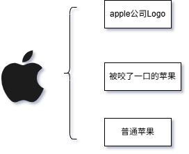

# 1.大模型如何睁眼看世界

当我们第一次使用大模型，或者说大语言模型第一次真正开始应用的时候，或许是2021年的GPT3的大爆发。  

在这个时候，人们似乎希望它无所不能，但是我们在这个时候，发现了大模型并非无所不能的事实。然而是什么让人们觉得失望，又是什么让大模型变得局限？
这的一切来自于大模型数据集的局限？

在后面的思考当中，我们意识到“大模型本身拥有远超人类记忆的数据存储，而缺乏与人类期望对齐的能力正是为何大模型无法满足人类期望的根本原因”

人类期望是检验大模型的能力的标准，而人类期望是来自人类对于事件本身的要求与预期目标（从对自身认知出发的预期目标），而自身认知来源于人类本身对于世界的理解，以及世界规则形成后的行为规范。

## 1.1什么是世界？

我们在今天讨论大模型之前，首先要理解的是，大模型本身是没有世界观的，追溯到计算机本身，计算机接收的也是0和1的二进制数据。计算机的世界，是由人类理解后所赋予给计算机的定义和规则。

在人类的世界上，人类对于世界的理解也是不统一的,如下图所示：

对于一种事物的认知是具有多样性的，而这个事务的本身并不具有意义，所有的定义源于人类认知，准确来说是人们对于该事务的下定义以及达成的共识。

就像上图所示，当我们只定义它的品类的时候，它在世界中被定义为水果中的苹果，而加入形状的定义之后，其被定义为缺了一口的苹果，在apple公司注册后，引起人类广泛共识之后，这就被定义为了苹果公司的Logo。

